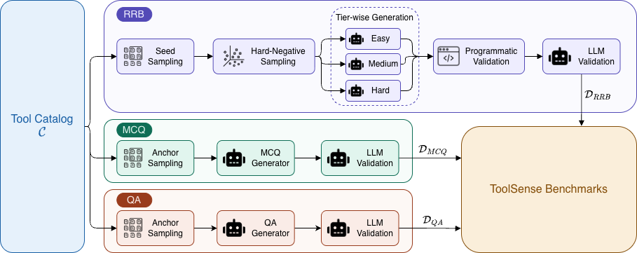

<h1 align="center">Project ToolSense</h1>

<p align="center">
  <strong>Opensource Diagnostic Framework for Auditing Parametric Tool Knowledge in LLMs</strong>
</p>

<p align="center">
  <a href="https://github.com/SAP/toolsense/blob/main/LICENSE"></a>
  <a href="https://www.python.org/downloads/"></a>
  <a href="https://github.com/SAP/toolsense/issues"></a>
  <a href="https://api.reuse.software/info/github.com/SAP/toolsense"></a>
</p>

<p align="center">
  <a href="#about-this-project">About</a> •
  <a href="#benchmarks">Benchmarks</a> •
  <a href="#requirements-and-setup">Setup</a> •
  <a href="#usage">Usage</a> •
  <a href="#datasets">Datasets</a> •
  <a href="#citation">Citation</a> •
  <a href="#support-feedback-contributing">Contributing</a>
</p>

---

## About this project

**Project ToolSense** is a diagnostic benchmark framework for auditing how well large language models encode parametric tool knowledge — the factual, semantic understanding of API tools stored directly in model weights rather than retrieved at runtime.

Given a catalog of tools (e.g., enterprise APIs described by name + description), ToolSense automatically generates three complementary benchmarks that probe different facets of tool comprehension:

| Benchmark | Type | Task | Random Baseline |
|---|---|---|---|
| **QA Probing** (`D_QA`) | Yes/No | Does the model understand binary tool properties from token semantics alone? | 50% |
| **MCQ Probing** (`D_MCQ`) | 4-way MCQ | Can the model identify factual properties of tools? | 25% |
| **Realistic Retrieval** (`D_RRB`) | Retrieval | Does the model select the right tool(s) for natural enterprise queries? | — |

All LLM calls use [LiteLLM](https://docs.litellm.ai/) — any OpenAI-compatible model, provider, or proxy works out of the box.

### Pipeline



The pipeline takes a **Tool Catalog C** and routes it through three parallel generation tracks. The Realistic Retrieval Benchmark (RRB) uses stratified seed sampling, hard-negative retrieval via ChromaDB, and tier-wise query generation (Easy / Medium / Hard), followed by both programmatic and LLM-based validation. The QA and MCQ tracks use anchor sampling and LLM generation with validation before producing their respective datasets.

---

## Benchmarks

### QA Probing Benchmark (`D_QA`)

Generates yes/no questions that probe binary tool properties (e.g., *"Does this tool process image inputs?"*). The model sees only the virtual tool token and the question — no tool name is revealed — forcing the model to answer from token semantics alone.

**Record format:**
```json
{"id": "...", "question": "Does this tool process image inputs?", "answer": "Yes", "tool": {...}}
```

---

### MCQ Probing Benchmark (`D_MCQ`)

Generates 4-way multiple-choice factual questions about tool properties. Random baseline: **25%**.

**Record format:**
```json
{
  "id": "...",
  "question": "What type of data does this tool primarily output?",
  "correct_answer": "financial transaction records",
  "wrong_answers": ["satellite imagery", "audio transcripts", "genomic sequences"],
  "tool": {...}
}
```

---

### Realistic Retrieval Benchmark (`D_RRB`)

Generates concise enterprise-style retrieval queries across three complexity tiers:

| Tier | Query maps to | Answer count |
|---|---|---|
| **Easy** | exactly one tool | 1 |
| **Medium** | genuinely ambiguous goal | 2–3 |
| **Hard** | broad business objective | 4+ |

Each query passes programmatic validation and LLM quality judging before acceptance. Hard negatives are retrieved via ChromaDB (`text-embedding-3-large`) to form realistic candidate pools.

**Eval record format** (compatible with `ToolRetrievalDataset`):
```json
{
  "sample_id": "...",
  "query": "Show me all open purchase orders",
  "tool": {"tool_name": "...", "tool_description": "..."},
  "analyzed_tools": [{"tool_name": "...", ...}, ...],
  "complexity": "easy"
}
```

---

## Requirements and Setup

### 1. Install [uv](https://docs.astral.sh/uv/)

```bash
curl -LsSf https://astral.sh/uv/install.sh | sh
```

### 2. Clone and install

```bash
git clone https://github.com/SAP/toolsense.git
cd toolsense
uv venv
uv pip install -e .
```

For development tools (pytest, ruff):

```bash
uv pip install -e ".[dev]"
```

### 3. Configure environment variables

```bash
cp .env.example .env
```

Open `.env` and fill in your values. Minimum required fields:

```dotenv
# LiteLLM proxy (for all generation calls)
LITELLM_BASE_URL=http://localhost:4000
LITELLM_API_KEY=your-key

# Default model — alias configured in your proxy, or a LiteLLM model string
DEFAULT_MODEL=claude-4.5-sonnet

# OpenAI key for text embeddings (realistic benchmark only)
OPENAI_API_KEY=sk-...
```

If you are **not** using a proxy, leave `LITELLM_BASE_URL` empty and set the provider key directly (`OPENAI_API_KEY`, `ANTHROPIC_API_KEY`, etc.).

---

## Tool file format

All scripts accept a `--tools-file` JSONL where each line is one tool:

```json
{"tool_name": "MyService&&GetOrders", "tool_description": "Returns open purchase orders for a given vendor."}
```

A ready-to-use tool catalog based on [ToolBench](https://github.com/OpenBMB/ToolBench) is provided at `data/toolbench-tools/data.jsonl`.

---

## Usage

### QA Probing Benchmark

```bash
uv run python generate_qa.py \
    --tools-file data/toolbench-tools/data.jsonl \
    --output qa_benchmark/qa_data.jsonl

# Smoke test — first 20 tools only
uv run python generate_qa.py \
    --tools-file data/toolbench-tools/data.jsonl \
    --output qa_benchmark/qa_data.jsonl \
    --num-samples 20

# Override model
uv run python generate_qa.py \
    --tools-file data/toolbench-tools/data.jsonl \
    --output qa_benchmark/qa_data.jsonl \
    --model claude-4.5-sonnet
```

Outputs: `qa_data.jsonl` + `data_card.md`

---

### MCQ Probing Benchmark

```bash
uv run python generate_mcq.py \
    --tools-file data/toolbench-tools/data.jsonl \
    --output mcq_benchmark/mcq_data.jsonl

# Smoke test
uv run python generate_mcq.py \
    --tools-file data/toolbench-tools/data.jsonl \
    --output mcq_benchmark/mcq_data.jsonl \
    --num-samples 20
```

Outputs: `mcq_data.jsonl` + `data_card.md`

---

### Realistic Retrieval Benchmark

**Step 1 — Prepare stratified seeds**

```bash
uv run python -m realistic_benchmark.seed_preparation \
    --tools-file data/toolbench-tools/data.jsonl \
    --n-seeds 1000 \
    --output seeds/seeds.jsonl
```

Sampling is stratified by service domain (tools named `Service&&Method` are grouped by `Service`).

**Step 2 — Smoke test (single seed)**

```bash
uv run python -m realistic_benchmark.run_generation test \
    --tools-file data/toolbench-tools/data.jsonl \
    --seeds-file seeds/seeds.jsonl
```

**Step 3 — Full batch generation**

```bash
uv run python -m realistic_benchmark.run_generation generate \
    --tools-file data/toolbench-tools/data.jsonl \
    --seeds-file seeds/seeds.jsonl \
    --output-dir output/ \
    --concurrency 8
```

`--concurrency` controls how many seeds are processed in parallel. Each seed spawns three async tier sub-pipelines (Easy + Medium + Hard) that run concurrently.

**Step 4 — Post-process into eval-ready JSONL**

```bash
uv run python -m realistic_benchmark.run_generation postprocess \
    --input output/samples.jsonl \
    --output output/eval.jsonl \
    --tools-file data/toolbench-tools/data.jsonl

# Filter to a single tier
uv run python -m realistic_benchmark.run_generation postprocess \
    --input output/samples.jsonl \
    --output output/eval_hard.jsonl \
    --tools-file data/toolbench-tools/data.jsonl \
    --complexity hard
```

---

### Entry points

After `uv pip install -e .`, the following CLI commands are available:

```bash
generate-qa            # → generate_qa:main
generate-mcq           # → generate_mcq:main
benchmark-seeds        # → realistic_benchmark.seed_preparation:main
benchmark-generate     # → realistic_benchmark.run_generation:main
benchmark-postprocess  # → realistic_benchmark.postprocess:main
```

---

## LiteLLM model strings

| Provider | Example |
|---|---|
| OpenAI | `openai/gpt-4o` |
| Anthropic | `claude-4.5-sonnet` |
| Azure OpenAI | `azure/gpt-4o` |
| AWS Bedrock | `bedrock/anthropic.claude-4.5-sonnet` |
| LiteLLM proxy alias | `claude-4.5-sonnet` (whatever your proxy config names it) |

Full list: <https://docs.litellm.ai/docs/providers>

---

## Datasets

Pre-generated benchmark datasets are included in `data/` and can be used directly for evaluation without re-running the generation pipeline:

| Dataset | Path | Description |
|---|---|---|
| Tool Catalog | `data/toolbench-tools/data.jsonl` | Source tool catalog (ToolBench-derived) |
| QA Benchmark | `data/toolsense-qa/data.jsonl` | Pre-generated yes/no probing benchmark |
| MCQ Benchmark | `data/toolsense-mcq/data.jsonl` | Pre-generated 4-way MCQ probing benchmark |
| Realistic Retrieval | `data/toolsense-realistic-retrieval/data.jsonl` | Pre-generated retrieval benchmark (easy/medium/hard) |

---

## Citation

If you use ToolSense in your research, please cite:

```bibtex
@misc{toolsense2026,
  title   = {ToolSense: A Diagnostic Framework for Auditing Parametric Tool Knowledge in LLMs},
  year    = {2026},
  url     = {https://github.com/SAP/toolsense}
}
```

---

## Contributors

<!-- ALL-CONTRIBUTORS-LIST:START - Do not remove or modify this section -->
<!-- prettier-ignore-start -->
<!-- markdownlint-disable -->
<table>
  <tbody>
    <tr>
      <td align="center" valign="top" width="14.28%"><a href="http://ashutoshhathidara.com"><br /><sub><b>Ashutosh Hathidara</b></sub></a><br /><a href="#research-ashutosh1919" title="Research">🔬</a> <a href="#code-ashutosh1919" title="Code">💻</a> <a href="#design-ashutosh1919" title="Design">🎨</a> <a href="#ideas-ashutosh1919" title="Ideas, Planning, & Feedback">🤔</a> <a href="#maintenance-ashutosh1919" title="Maintenance">🚧</a></td>
      <td align="center" valign="top" width="14.28%"><a href="https://github.com/sai-shruthi-s"><br /><sub><b>Sai Shruthi Sistla</b></sub></a><br /><a href="#research-sai-shruthi-s" title="Research">🔬</a> <a href="#code-sai-shruthi-s" title="Code">💻</a> <a href="#design-sai-shruthi-s" title="Design">🎨</a> <a href="#ideas-sai-shruthi-s" title="Ideas, Planning, & Feedback">🤔</a> <a href="#maintenance-sai-shruthi-s" title="Maintenance">🚧</a></td>
    </tr>
  </tbody>
</table>

<!-- markdownlint-restore -->
<!-- prettier-ignore-end -->

<!-- ALL-CONTRIBUTORS-LIST:END -->

---

## Support, Feedback, Contributing

This project is open to feature requests/suggestions, bug reports etc. via [GitHub issues](https://github.com/SAP/toolsense/issues). Contribution and feedback are encouraged and always welcome. For more information about how to contribute, the project structure, as well as additional contribution information, see our [Contribution Guidelines](CONTRIBUTING.md).

## Security / Disclosure
If you find any bug that may be a security problem, please follow our instructions at [in our security policy](https://github.com/SAP/toolsense/security/policy) on how to report it. Please do not create GitHub issues for security-related doubts or problems.

## Code of Conduct

We as members, contributors, and leaders pledge to make participation in our community a harassment-free experience for everyone. By participating in this project, you agree to abide by its [Code of Conduct](https://github.com/SAP/.github/blob/main/CODE_OF_CONDUCT.md) at all times.

## Licensing

Copyright 2026 SAP SE or an SAP affiliate company and toolsense contributors. Please see our [LICENSE](LICENSE) for copyright and license information. Detailed information including third-party components and their licensing/copyright information is available [via the REUSE tool](https://api.reuse.software/info/github.com/SAP/toolsense).
